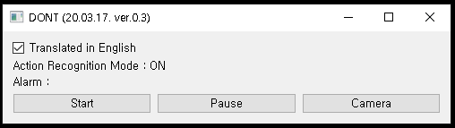
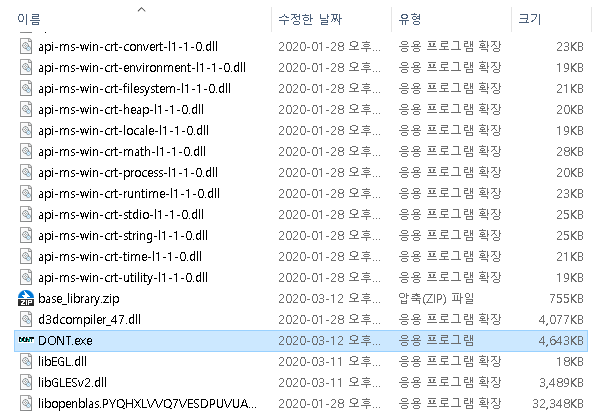
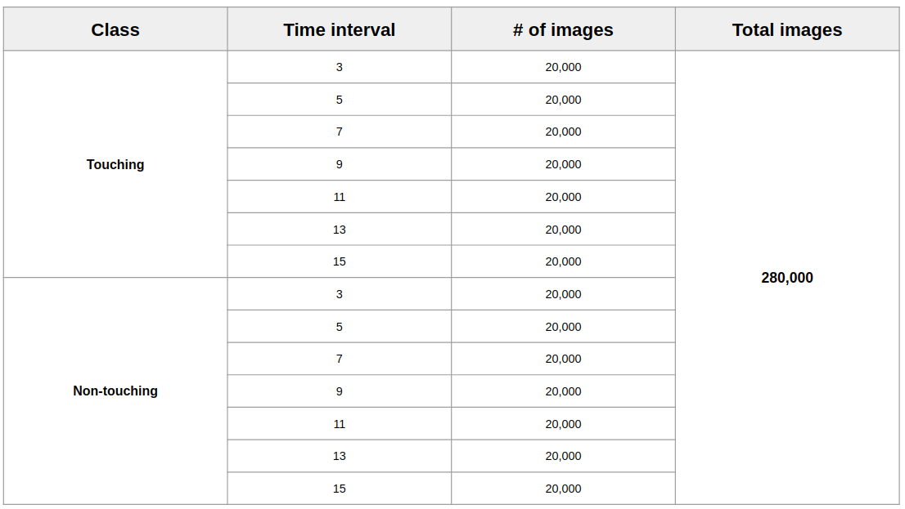
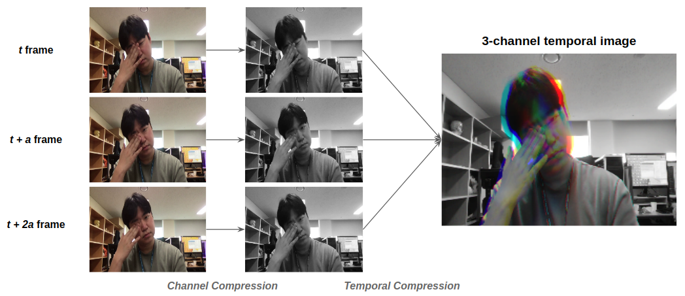
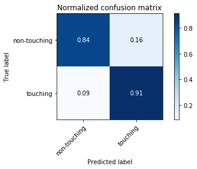

<div style="width:40px;height:30px;float:right;">
    <p align="right"><a href="https://github.com/mi2rl/DONT/blob/master/README_ENG.md"></a></p>
</div>
<div style="width:40px;height:30px;float:right;">
    <p align="right"><a href="https://github.com/mi2rl/DONT/blob/master/README.md"></a></p>
</div>
<div style="width:40px;height:30px;float:right;">
    <p align="right"><a href="https://github.com/mi2rl/DONT/blob/master/README_FR.md">FRANÇAIS</a></p>
</div>

<p align="center"></p>
<br>

# NE touchez PAS votre visage (DONT)

* Lien de téléchargement (fichier exécutable): https://www.dropbox.com/s/2rfqog5kxuq4hmw/dont-release.ver.0.3.zip?dl=0
* DONT (R) a été développé pour surmonter la pandémie de 2019 du SRAS-CoV-2 dans le monde par MI2RL @ Asan Medical Center, Corée du Sud
* Un réseau pré-formé est disponible (dossier de poids)
* Vidéo de démonstration: https://youtu.be/Yn7jqsNAmNk

<br>


## NEWS (20.03.30): DONT ver.0.4

* **Ajoutez la version MobileNet.**
  * **Peut reconnaître les actions touchant le visage en 0,07 s avec le processeur Intel (R) Core i7-6700 à 3,40 GHz ou plus (précision de 92%)**
* À FAIRE:
  * Téléchargez un article sur Arxiv à propos de ce projet
  * Ajouter des effets sonores pour l'alarme
  * Ajouter une fonction "rapport" basée sur le mode de surveillance 24 heures
  * Augmenter les langues prises en charge (Eng, Jap) pour GUI
  * Essayez des clips vidéo de caméras de sécurité montées au plafond
  * Développer un modèle léger pour les téléphones portables, machine uniquement CPU

<br>

## Installation

```bash
# Clonez ce référentiel et entrez-le:
$ git clone https://github.com/mi2rl/DONT.git

# Configurer l'environnement
$ conda create -n [nom de votre environnement virtuel] python3

# Activer l'environnement
$ conda activate fta_gpu

# Installez toutes les dépendances
$ pip install torch == 1.2.0 + cu92 torchvision == 0.4.0 + cu92 -f https://download.pytorch.org/whl/torch_stable.html

$ pip install -r requirements.txt
```

  <br>


## Guide rapide

* Le programme GUI peut être exécuté en utilisant

```bash
  $ python main.py
```


* GUI

  <p align="center">  </p> <br>
  
  * Exécuter/mettre en pause le classificateur par le bouton 'Démarrer'/'Pause'
    * Le résultat du classificateur d'action sera affiché
  * Activez l'affichage de la webcam en direct à l'aide du bouton "Appareil photo"
  <br>
  
* Exécutez l'application Windows (EXE)
  * Décompressez un fichier .zip téléchargé, puis exécutez "DONT.exe"
    <p align="center">  </p> <br>
* Lorsque la fenêtre d'affichage de la webcam est activée, les autres boutons sont désactivés (Quittez le mode d'affichage de la webcam et appuyez sur les boutons)
* **Si la webcam n'est pas prête, le logiciel ne fonctionne PAS correctement.**
<br>


## Plus de détails

* **Justification**
    * Une étude quantifiant le taux de contact main-à-face et son application potentielle pour prédire l'infection des voies respiratoires (https://www.tandfonline.com/doi/full/10.1080/15459620802003896)
    * Contrôler le nouveau virus de la grippe A (H1N1): ne touchez pas votre visage! (https://www.journalofhospitalinfection.com/article/S0195-6701(09)00255-2/abstract)
    * Pratiques d'hygiène des mains dans une unité de soins intensifs néonatals: intervention multimodale et impact sur les infections nosocomiales (https://pediatrics.aappublications.org/content/114/5/e565.short)
      
* **Jeux de données**
    * Afin de créer l'ensemble de données de formation, les membres [MI2RL] (https://www.mi2rl.co/) et de nombreux collaborateurs ont contribué. En conséquence, nous avons rassemblé un total de 190 000 images
    * Des clips vidéo ont été enregistrés dans plus de 10 endroits différents
    * Classes d'action: 11 classes
      * Classes générales: boire, décrocher le téléphone, retirer le masque, reposer le menton sur la main, se frotter les yeux, toucher les lunettes, toucher les cheveux, toucher le clavier, toucher le nez, toucher le téléphone, porter un masque
      * Actions touchant: décrocher le téléphone, reposer le menton sur la main, se frotter les yeux, toucher les cheveux, toucher le nez
        
    
* **Réseau de classification des actions (I3D / MobileNet3)**
  * Réseau I3D (https://github.com/deepmind/kinetics-i3d)
    * Phase de formation
      * Le nombre d'images dans chaque pile pour 3D CNN: 16
      * Augmentation des données
        * Étape dans les images entre chaque clip: 4
        * Distorsion des couleurs
        * Rotation
    * Phase d'inférence
      * Le nombre d'images dans chaque pile pour 3D CNN: 24
  * MobileNet3 (https://github.com/d-li14/mobilenetv3.pytorch)
    * Phase de formation
      * Le nombre d'images dans chaque pile pour CNN: 3
        * Faire une image à 3 canaux comme intervalle de temps suivant (3, 5, 7, 9, 11, 13, 15)
        * Chaque intervalle de temps, nous faisons 20 000 images. Ainsi, le nombre d'images d'entraînement est de 280 000.
         <br>
      * Configuration du jeu de données
        <br>
         <br>
      * Phase d'inférence
        * Intervalle de temps (foulée): 3 images
* **Spécifications H/W**
    * Spécifications du test.
      * GPU: Geforce GTX 960 4 Go
      * CPU: Intel (R) Core i7-6700 CPU 3,40 GHz
      * OS: Linux Ubuntu 18.04
      * Inférence
        * Réseau I3D
          * 0,07 ~ 0,085 s sur le GPU
          * 1,4 ~ 1,5 s sur le processeur
          * Utilisation du processeur ≈ 35%
          * Utilisation de la mémoire GPU ≈ 1,1 Go
        * MobileNet v3
          * 0,03 ~ 0,04 s sur le GPU
          * 0,07 ~ 0,09 s sur le processeur
          * Utilisation du processeur ≈ 4%
          * Utilisation de la mémoire GPU ≈ 520 Mo
      
    * Spécifications minimales
      * Geforce GTX 960 4 Go
      * Processeur Intel (R) Core i7-6700 à 3,40 GHz
      * OS: Linux / Windows
    <br>

## Résultats expérimentaux

**Matrice de confusion: classe binaire**
<p align = "center">  </p> <br>
<br>

## Limitations

* DONT a commencé le 2020.03.05. Nous avons décidé qu'il serait plus souhaitable d'appeler à des efforts conjoints grâce à une diffusion plus rapide que la création de programmes performants, nous avons donc décidé de procéder à la divulgation malgré le manque de progrès.

<br>


## Comment faire don de vos données

* Pour un modèle plus robuste pour DONT, nous avons besoin de plus de données provenant de différents environnements et personnes.
  Si vous souhaitez faire don de vos données, veuillez les envoyer à namkugkim@gmail.com. Votre vie privée sera strictement protégée, aussi forte que possible.
  <br>


### Ligne directrice pour le don de données

* Veuillez prendre une vidéo et l'envoyer à l'adresse e-mail ci-dessus.
* Le processus d'enregistrement est le suivant.
  * Porter un masque -> (Avec un masque) -> Toucher le nez -> Se reposer le menton sur la main -> Frotter les yeux -> Toucher les cheveux -> Eau potable-> Toucher le téléphone -> Prendre le téléphone -> Toucher le clavier -> (Sans un masque) -> Toucher le nez -> Menton au repos sur la main -> Se frotter les yeux -> Toucher les cheveux -> Eau potable-> Toucher le téléphone -> Prendre le téléphone -> Toucher le clavier
  * Le temps d'enregistrement vidéo moyen est d'environ 90 secondes.
  * Exemple: [Instructions pour l'enregistrement vidéo] (https://youtu.be/NU5FlHp6Qgg)

<br>

## Contributeurs au projet

* Réseau de neurones artificiels et développement d'interface graphique
  * Sungman Cho (dev.sungman@gmail.com), Minjee Kim (minjeekim00@gmail.com)
* Acquisition et annotation de données
  * Dr Joonmyeong Choi (jm5901@gmail.com), Taehyung Kim (kimtaehyeong62@gmail.com), Juyoung Park (godoctorsam@gmail.com)
* Direction générale: Prof. Namkug Kim (namkugkim@gmail.com)
* Fournisseur de données: 37 chercheurs du MI2RL, le professeur Dong-woo Seo (département de médecine d'urgence à l'AMC), le professeur Namkug Kim (département de radiologie à l'AMC), le professeur Sunjin Lim (hôpital dentaire SNU)
